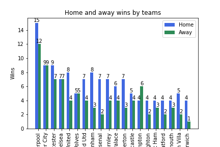
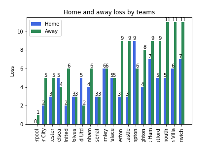
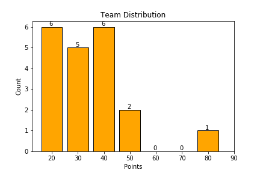
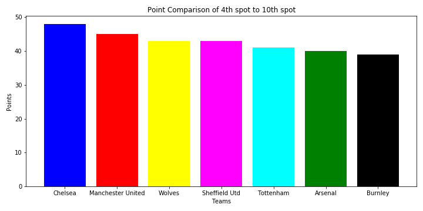
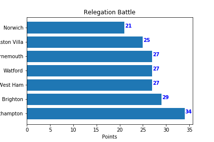

# Visualising the 2019-20 Season of Barclays Premier League

Authors:  **Ashwin Nair** , **Vishesh Singh Thakur** , **Gaurav Chaudhary** , and **Adil Baran Narin**


---

## Introduction
*The purpose of this project is to visualise the standings of Barclays Premier league*
- *The type of data that is being imported is a ranking system of a football league which follows round robin procedure to decide the final winners* 
- *Data used for this projected is from the website - https://www.api-football.com/ and the API used comes from rapid API - https://rapidapi.com/api-sports/api/api-football?endpoint=apiendpoint_c8a3886a-cfdb-403f-a6ba-b5a3e84cfbb7*  

- *The data that is being used for this project was last updated on 23rd March 2020 and once, the Corona pandemic is over and the league restarts it will be updated every two footballing weeks*

---

## Sources
- The source code came from [Rapidapi](https://rapidapi.com/api-sports/api/api-football?endpoint=apiendpoint_c8a3886a-cfdb-403f-a6ba-b5a3e84cfbb7)
- The code retrieves data from [A restful API of football data](https://www.api-football.com/)

---

## Explanation of the Code
*Our code is divided into three subparts. It takes the data from the Barclays Premiere League and uses its data to show the various statistics of the league table*
- *The first part of the code is to show the dominance of the top team in the league table, which is Liverpool for the current season. The first graph shows the games won by the respective team in home and away games. The next graph shows the games lost by each team in their home and away matches. The third graph shows the grouping of the teams at various levels of points in the points table*
- *The second part of the code is to see the competition among the teams from the 4th rank to the 10th rank. As the points difference between them is less, the competition becomes more tough*
- *The third part of the code gives us the details of the Relegation Battle, which is the battle among the last few teams with points lower than 35 in the points table to keep away from being in the last three teams at the end of the season*

The code, `BPL_A7.py`, begins by importing necessary Python packages:
```
import http.client
import json
import pandas as pd
import numpy as np
import matplotlib.pyplot as plt
```

- *The required packages can be installed using the following codes*
- *For json*
```
npm install -g json
```
- *For Pandas*
```
pip install pandas
```
- *For Numpy*
```
python -m pip install --user numpy scipy matplotlib ipython jupyter pandas sympy nose
```

We then import data from [https://www.api-football.com]. The following code extracts the data from its source using the APIkey by requesting the data from the host and reading their response. We then store the incoming data in a variable, read it, and then decode it so it can be used. The reading and decoding step filters the data into readable format. We print the data to allow us to verify what we've imported:
```
conn = http.client.HTTPSConnection("api-football-v1.p.rapidapi.com")

headers = {
    'x-rapidapi-host': "api-football-v1.p.rapidapi.com",
    'x-rapidapi-key': RAPIDAPIKEY
    }
conn.request("GET", "/v2/leagueTable/524", headers=headers)

resp  = conn.getresponse()
data = resp.read().decode("utf-8")

print(type(data))
print(data)	
```
In the following code, the data is first filtered through json, which is a lightweight data-interchange format. It makes it easy for humans to read and write, and easy for machines to parse and generate. The data is saved as a combination of several dictionaries and lists inside each other. We filter the required data and save them into different variables, such as the names of the teams, the homewins, total points, etc
```
persons = json.loads(data)
persons.keys()
print(persons)

team = []
homewin = []
awaywin = []
homeloss=[]
awayloss = []
totalplayed=[]
goalsDiff = []

for i in range(20):
    team.append(persons['api']['standings'][0][i]['teamName'])
    totalplayed.append(persons['api']['standings'][0][i]['all']['matchsPlayed'])
    homewin.append(persons['api']['standings'][0][i]['home']['win'])
    awaywin.append(persons['api']['standings'][0][i]['away']['win'])
    homeloss.append(persons['api']['standings'][0][i]['home']['lose'])
    awayloss.append(persons['api']['standings'][0][i]['away']['lose'])
    goalsDiff.append(persons['api']['standings'][0][i]['goalsDiff'])
```
The data extracted in the previous steps are used to visualize it
For the first part of visualization, we show how liverpool dominated the season using the following graphs:
```
#PLOT 1
width = 0.35       # the width of the bars

N=20
ind = np.arange(N)
fig = plt.figure()
ax = fig.add_subplot(111)
rects1 = ax.bar(ind, homewin, width, color='royalblue')

rects2 = ax.bar(ind+width, awaywin, width, color='seagreen')

# add some
ax.set_ylabel('Wins')
ax.set_title('Home and away wins by teams')
ax.set_xticks(ind + width / 2)
ax.set_xticklabels(team, rotation=90)

ax.legend( (rects1[0], rects2[0]), ('Home', 'Away') )
def autolabel(rects):
    
    for rect in rects:
        height = rect.get_height()
        ax.text(rect.get_x() + rect.get_width()/2., 1.0*height,
                '%d' % int(height),
                ha='center', va='bottom')

autolabel(rects1)
autolabel(rects2)

plt.show()

#PLOT 2
width = 0.35       # the width of the bars

N=20
ind = np.arange(N)
fig = plt.figure()
ax = fig.add_subplot(111)

rects1 = ax.bar(ind, homeloss, width, color='royalblue')

rects2 = ax.bar(ind+width, awayloss, width, color='seagreen')

# add some

ax.set_ylabel('Loss')
ax.set_title('Home and away loss by teams')
ax.set_xticks(ind + width / 2)
ax.set_xticklabels(team, rotation=90)

ax.legend( (rects1[0], rects2[0]), ('Home', 'Away') )
def autolabel(rects):
    
    for rect in rects:
        height = rect.get_height()
        ax.text(rect.get_x() + rect.get_width()/2., 1.0*height,
                '%d' % int(height),
                ha='center', va='bottom')

autolabel(rects1)
autolabel(rects2)

plt.show()

#PLOT 3
z = []
for i in range(20):
        z.append(persons['api']['standings'][0][i]['points'])

ymin = min(z)

ymax = max(z)

plt.title("Team Distribution")
plt.ylabel('Count')
plt.xlabel('Points')
bi = [20,30,40,50,60,70,80,90]
counts, bins,_= plt.hist(z,bins =bi,rwidth =0.80, range = (ymin,ymax),color = 'orange',edgecolor = 'black',align="left")
plt.xticks(bins)
for n, b in zip(counts, bins):
        plt.gca().text(b-1, n+0.05, int(n));
plt.show()

Points=[]
for i in range(20):
    Points.append(persons['api']['standings'][0][i]['points'])

fig1, ax1 = plt.subplots(figsize=(30,10))
explode = (0.25, 0.2, 0.15, 0.1,0.05,0,0,0,0,0,0,0,0,0,0,0,0,0,0,0)
ax1.pie(Points,labels = team,shadow = False,startangle = 0,autopct='%1.1f%%',explode = explode)
ax1.set(Title = "Total points Comparison")
plt.tight_layout()
plt.show()
```






---

The second part of visualization shows us the competition for the 4th and the final champions league spot between 6 teams. As evident from the plot, the points margin between the teams from 4th spot to 10th spot is very small and a small change of the tide could take the lowly 10th placed Burnley to last champions league spot(i.e 4th place in the table).The following code visualizes the plot:
```
x = []
y = []
for i in range(20):
    if(4 <=  persons['api']['standings'][0][i]['rank'] <= 10):
        x.append(persons['api']['standings'][0][i]['teamName'])
        y.append(persons['api']['standings'][0][i]['points'])
fig1, ax1 = plt.subplots(figsize=(10,5))
ax1.set(Title = 'Point Comparison of 4th spot to 10th spot',xlabel = "Teams",ylabel = "Points")

ax1.bar(x,y,color = ['blue','red','yellow','magenta','cyan','green','black'])

plt.tight_layout()
plt.show()
```



The third part of visualization shows the competition among the last few teams to stay out of relegation. When a new season starts a smaller team tries to aim atleast 35 points get to get to the safe cushion of playing the in premier league the following season . The following code visualizes the plot for the relegation battle:
```
rel_teams = []
rel_points = []
for i in range(20):
    if(persons['api']['standings'][0][i]['points']<35):
        rel_teams.append(persons['api']['standings'][0][i]['teamName'])
        rel_points.append(persons['api']['standings'][0][i]['points'])
fig, ax = plt.subplots()    
ax.barh(rel_teams,rel_points)

for i, v in enumerate(rel_points):
    ax.text(v + 0.1, i + 0, str(v), color='blue', fontweight='bold')
ax.set(Title = "Relegation Battle",xlabel = "Points",ylabel = "Teams");
plt.show()
```



## How to Run the Code
*After installing all the required packages, the following steps can be performed to run the code:*
1. Open a terminal window.

2. Change directories to where `BPL_A7.py` is saved.

3. Type the following command:
	```
	python BPL_A7.py
	```

---

## Suggestions
*The data can be used to see how the various teams perform at home and away matches. It can also be used to see how the goal difference affects the points table for teams with similar points*
